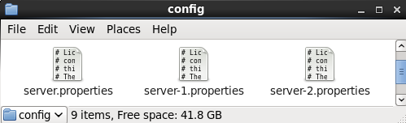
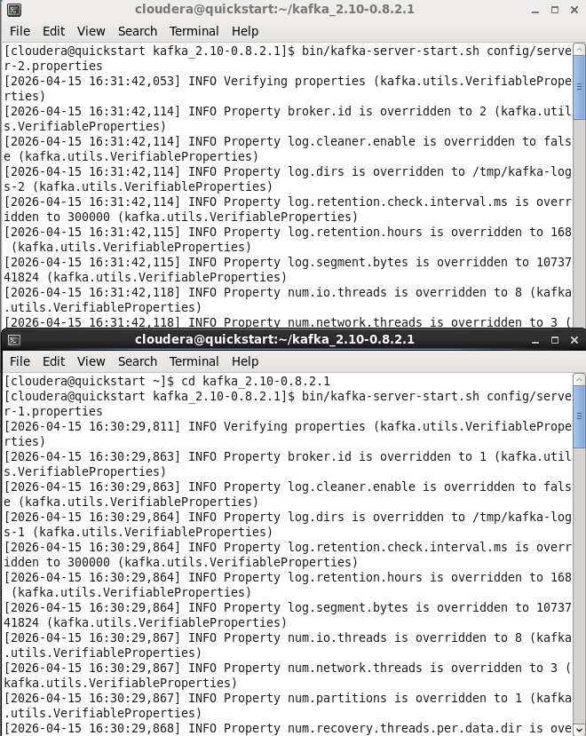
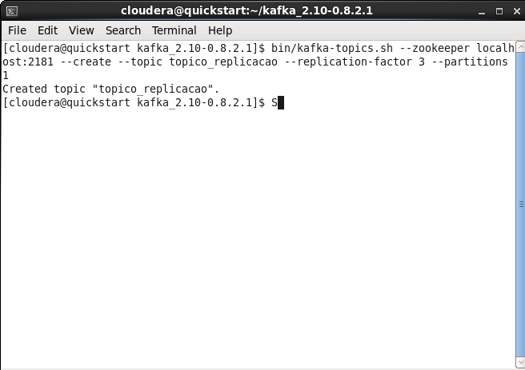
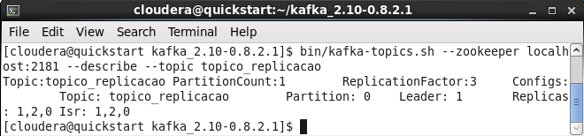
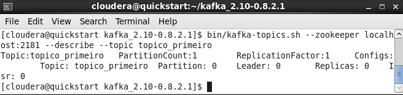
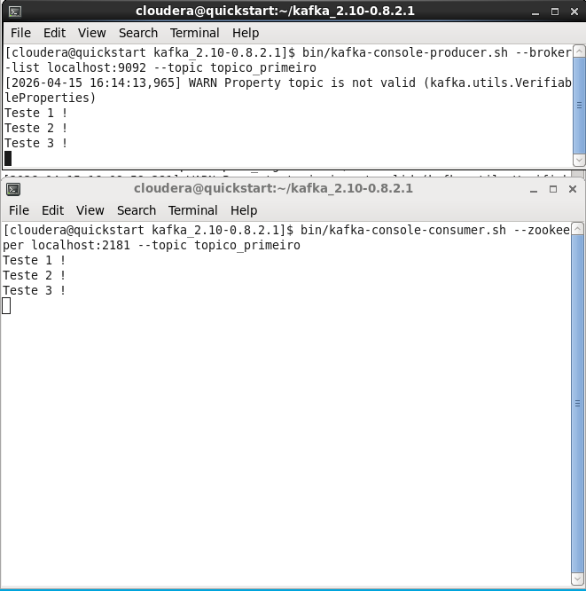
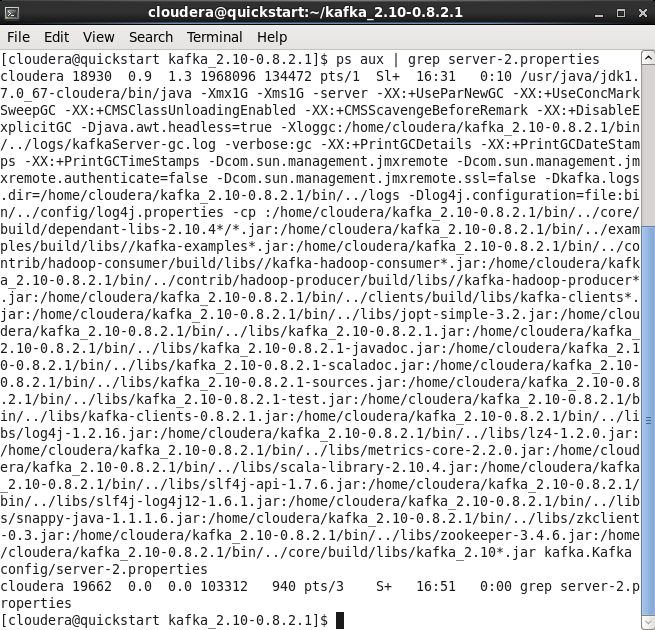
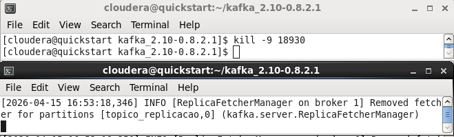
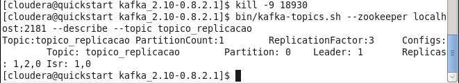

# Apache Kafka: Cluster Multi-Broker e Tolerância a Falhas 🚀

Este repositório documenta a implementação prática de um cluster **Apache Kafka** configurado com múltiplos brokers, focado em alta disponibilidade e resiliência. O projeto foi desenvolvido como parte dos estudos de Engenharia de Dados na **FIAP**.

## 🛠️ Tecnologias Utilizadas
* **Plataforma:** Cloudera Quickstart VM
* **Apache Kafka:** v0.8.2.1
* **Zookeeper:** Orquestração e eleição de líderes.
* **Linux Terminal:** Gerenciamento de processos e configuração de ambiente.

---

## 🏗️ Estrutura do Cluster
Para simular um ambiente de produção em uma única instância, foram configurados três brokers independentes, cada um com sua própria identidade e isolamento de dados:

| Broker | ID | Porta | Diretório de Logs |
| :--- | :---: | :---: | :--- |
| **Broker 0** | 0 | 9092 | `/tmp/kafka-logs` |
| **Broker 1** | 1 | 9093 | `/tmp/kafka-logs-1` |
| **Broker 2** | 2 | 9094 | `/tmp/kafka-logs-2` |

> **Nota Técnica:** O isolamento das portas e diretórios de logs é fundamental para permitir a execução de múltiplas instâncias do Kafka em um único nó sem conflitos de recursos.

---

## 🛡️ Teste de Resiliência e Alta Disponibilidade

O objetivo principal deste laboratório foi validar a capacidade do Kafka de sobreviver a falhas críticas de hardware sem perda de dados.

### 1. Criação do Tópico Replicado
Utilizei um **Fator de Replicação 3**, garantindo que as mensagens fossem espalhadas por todos os nós ativos.
```bash
bin/kafka-topics.sh --create --topic topico_replicacao --replication-factor 3 --partitions 1
2. Simulação de Desastre (Kill Process)
Para testar a resiliência, identifiquei o processo do Broker que atuava como Leader no momento e forcei sua interrupção:

Bash
# Identificando o PID do Broker 2
ps aux | grep server-2.properties

# Finalizando o processo de forma crítica
kill -9 [PID]
3. Resultado: Eleição Automática de Líder
Através do comando --describe, foi possível validar que o ecossistema (Kafka + Zookeeper) detectou a queda e promoveu automaticamente um novo líder.

Estado Inicial: Leader: 2 | Replicas: 1,2,0 | Isr: 1,2,0

Estado Pós-Falha: Leader: 1 | Replicas: 1,2,0 | Isr: 1,0

📊 Conclusões
Este projeto demonstra que a arquitetura distribuída do Kafka permite:

Escalabilidade Vertical: Rodar múltiplos brokers em um servidor para desenvolvimento.

Tolerância a Falhas: Manter a disponibilidade dos dados mesmo quando um ou mais nós do cluster ficam inoperantes.

Consistência: O uso de réplicas sincronizadas (ISR) garante a integridade da informação em cenários de recuperação de desastres.

Desenvolvido por Pedro Henrique Sotero Bastos Estudante de Ciência de Dados na FIAP.
```

### Evidencias de Execução

Visualização dos arquivos de propriedades customizados (server.properties, server-1.properties e server-2.properties) para permitir a execução de múltiplos brokers em uma única instância, garantindo isolamento de portas e logs




Execução simultânea de múltiplos brokers Kafka. A imagem demonstra o cluster operacional com diferentes IDs de broker e listeners configurados.




Comando de criação do tópico topico_replicacao com um Fator de Replicação 3, distribuindo os dados entre todos os nós do cluster para garantir alta disponibilidade.




Estado inicial do cluster saudável. O comando describe mostra o Líder (Broker 1) e a lista de réplicas sincronizadas (ISR: 1, 2, 0).




Contraste técnico: Tópico simples configurado com apenas 1 réplica. Neste cenário, qualquer falha no Broker 0 resultaria em perda imediata de disponibilidade.




Validação de fluxo end-to-end. Demonstração de mensagens enviadas via console-producer sendo recebidas em tempo real pelo console-consumer através do cluster multi-broker.




Uso do comando ps aux para identificar o PID (Process ID) do Broker 2. Este passo é essencial para realizar o encerramento forçado e testar a resposta do Zookeeper.




Execução do comando kill -9 no processo do líder. Ao fundo, observa-se o log do sistema registrando a perda de conexão e o início da reconfiguração do cluster.




Evidência final de resiliência. Após a queda do Broker 2, o sistema realizou uma nova eleição automática: o Broker 1 assumiu a liderança e o ISR foi atualizado para (1, 0), mantendo o serviço online.

